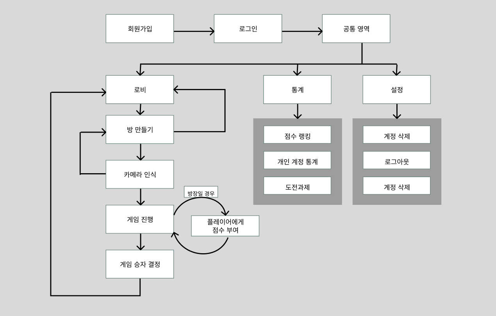
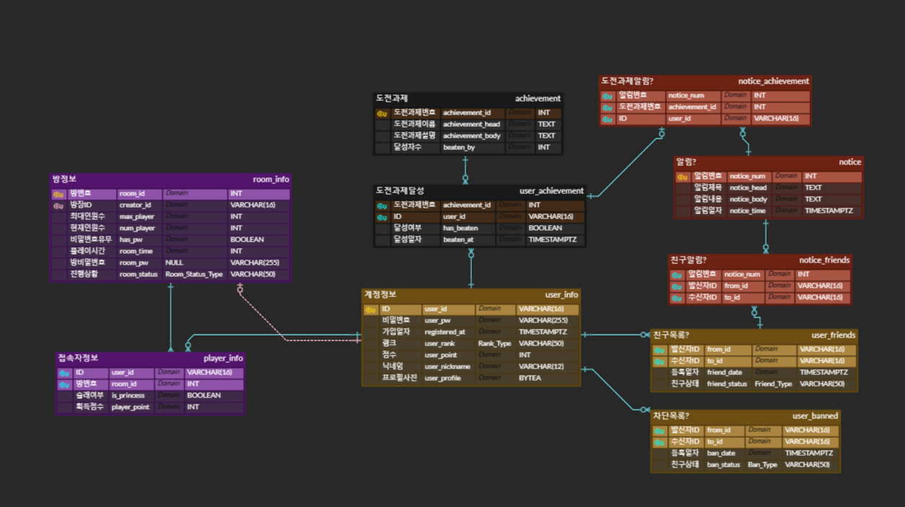

# 26s-w2-c3-05

## 공통과제 II : 협업형 실전 산출물 제작 (2인 1팀)

**목적:** 실시간 인터랙션, LLM Wrapper, Cross-Platform 중 하나의 옵션을 선택해 구현하며, 선택한 기술을 실제로 동작하는 형태의 산출물로 완성한다.

**선택 옵션:**

| 옵션 | 설명 |
|---|---|
| 실시간 인터랙션 | 사용자 간 상태 변화, 실시간 데이터 흐름, 스트리밍 응답 등 실시간성이 드러나는 기능을 구현 |
| LLM Wrapper | LLM API를 활용하여 AI 기능이 포함된 산출물을 구현 |
| Cross-Platform | 하나의 산출물을 여러 실행 환경에서 사용할 수 있도록 구현* |

> *데스크톱 앱 ↔ 모바일 앱; 혹은 다른 폼팩터에서의 앱; 웹만/웹 기반 프레임워크(Electron, Tauri 등) 대신 다른 프레임워크를 시도해보는 것을 적극 권장

**결과물:** 선택한 옵션이 적용된 작동 가능한 산출물, 실행 가능한 코드, 시연 자료 및 관련 문서

---

## 팀원

| 이름 | 학교 | GitHub | 역할 |
|---|---|---|---|
| 박민수 | 한양대학교 | miinspp | 백엔드, DB, 배포 |
| 서영빈 | 한국과학기술원 | izayoieosd | 프론트엔드, DB, 에셋 |

---

## 선택 옵션

- [ O ] 실시간 인터랙션
- [ X ] LLM Wrapper
- [ X ] Cross-Platform

---

## 기획안

- **산출물 주제:** 술래를 웃게 만드는 것이 목표인 다대일 실시간 모션 인식 코미디 파티 게임 
- **제작 목적:** 대용량 처리를 이용한 온라인 파티 게임 중에서 사용자들 간의 대화가 주제가 되는 게임은 여럿 있어 왔으나, 그 가운데 "다른 사용자를 웃기는 것"을 핵심 목표로 삼는 게임은 여태껏 시도되지 않은 영역이었음. 
- **선택 옵션:** 
- **핵심 구현 요소:** 
  - 카메라와 마이크로 실시간으로 입력된 자세, 표정 및 음성 정보 처리로 다른 사용자들의 표정과 기분을 알 수 있도록 하고, 실제 화상 대신 버추얼 아바타가 표시되도록 해 재미를 더함
  - 사용자 본인이 웃을 시 체력이 감소하고, 반대로 상대를 웃길 시 점수를 얻을 수 있는 시스템으로 경쟁의식 유도
  -
- **사용 / 시연 시나리오:**
- **팀원별 역할:**
박민수 : 백엔드 및 프론트엔드 총괄 및 검수, 서버 구축 및 배포
서영빈 : DB, 프론트엔드 API, 배경 / 3D 모델 / BGM 에셋 제작

### 개발 일정

| 날짜 | 목표 |
|---|---|
| Day 1 | 필요한 API 기획, 간략한 워크플로우, 와이어프레임 설계, ERD 작성 |
| Day 2 | 기획 논의, 얼굴 모션 캡처 기능 완료, 3D 모델, 배경화면 및 UI 에셋 제작, 배경음악 제작 |
| Day 3 | 프론트엔드 완성, 하인 모델 리깅 및 vrm 모델로 포팅 |
| Day 4 | 백엔드 개발 착수, 백엔드 / 프론트엔드 연결, 모델 제작 및 리깅 (필요 에셋 전부 완성) |
| Day 5 | 배포 준비, 필요 에셋 제작 마무리, 백엔드 완성 및 수정, 실시간 배경음악 출력 |
| Day 6 | 배포용 도메인 발급(https), 서버 및 ws 구축, 로그인/회원가입, 방 생성, 게임 페이지 제작, 음성인식 기능, 추가 모델 제작, 각종 버그 해결 |
| Day 7 | 웃는 표정 인식 기능 제작, 비율이 맞지 않는 UI 다듬기, 제목 정하기 |

---

## 구현 명세서

| 구현 요소 | 설명 | 우선순위 |
|---|---|------|
| 회원 인증 (JWT) | 회원가입 · 로그인 · 토큰 재발급 · 로그아웃, 아이디/닉네임 중복 확인. WebSocket 핸드셰이크도 `Bearer` 토큰으로 인증 | 필수   |
| 로비 · 방 관리 | 방 생성/입장/퇴장, 방 목록(정원 · 현재 인원 · 비밀번호 유무), 준비 · 시작. 방장 전용 설정 변경 · 강제 퇴장 | 필수   |
| 실시간 게임 진행 (STOMP) | 라운드 순환 · 공주(술래) 간택 · 서버 타이머 · 라운드 종료 · 게임 종료/중단을 방 전원에게 브로드캐스트. 판정은 서버 권위로 처리 | 필수   |
| 웹캠 얼굴 트래킹 → VRM 아바타 | MediaPipe로 표정(블렌드셰이프) · 머리 회전을 추출해 `three-vrm` 3D 아바타로 렌더. 웹캠 원본 영상은 서버로 전송하지 않음 | 필수   |
| 표정 실시간 동기화 | 각 참가자의 얼굴 파라미터를 소켓으로 중계해 공주 · 신하 아바타를 전원 화면에서 동일하게 구동 | 필수   |
| 웃음 감지 · 어점(御點) 점수 | 공주의 웃음(happy)을 감지하면 신하들이 어점 획득(라운드 상한 적용). 점수 계산 · 검증 · 방송을 서버가 담당하고 최종 합계로 승자 결정 | 필수   |
| 실시간 채팅 (어전 대화) | STOMP 기반 방 채팅. 공주 발언 강조 표시 | 필수   |
| 결과 · 전적 반영 | 최종 점수 결과 화면, 승패 · 랭크 산정 및 전적(stat) DB 반영 | 필수   |
| WebRTC 음성 채팅 | 방 인원 간 P2P 메시(mesh) 음성. STOMP로 시그널링하고 STUN/TURN으로 NAT 통과 | 필수   |
| 공주 권한 상호작용 | 공주가 특정 신하에게 어점을 직접 하사하거나, 신하 마이크를 강제 음소거/해제 | 선택   |
| 조아리기 모션 연출 | 큰절(bow) 모션과 말풍선을 방 전원의 아바타에 실시간 중계 | 선택   |
| 랭킹 보드 | 누적 point 기준 랭킹과 랭크 티어(BRONZE~DIAMOND) 표시 | 선택   |
| 친구 | 친구 요청 · 수락 · 거절 · 삭제, 유저 검색 | 선택   |
| 알림 | 친구 요청/수락 · 시스템 알림, 안 읽음 개수 뱃지, 개인 큐 실시간 수신 | 선택   |
| 발언 주제 | 라운드마다 랜덤 발언 주제 제공 | 선택   |
| 프로필 이미지 | 프로필 이미지 업로드 · 조회 | 선택   |
| 배경음악 (BGM) | 로비 · 게임 · 결과 등 화면별 배경음악 재생 | 선택   |

---

## 아키텍처



<!-- 실시간 인터랙션: WebSocket/SSE/WebRTC 구조도 --!>

<!-- Cross-Platform: 플랫폼 구성도 -->

---

## 설계 문서


### 화면 / 인터페이스 설계

<!-- Figma 링크, 화면 이미지, CLI 사용 예시, 앱 화면 등 -->

### 데이터 구조


<!-- DB 스키마, JSON 구조, 파일 저장 방식 등 -->

### API / 외부 서비스 연동

## 인증 `/auth` 🔓

| Method | Path | 인증 | 설명 | Request | Response |
|---|---|---|---|---|---|
| POST | `/auth/signup` | 🔓 | 회원가입 | `{ userId, userPw, userNickname }` | `201` 생성된 유저 요약 |
| POST | `/auth/login` | 🔓 | 로그인 → 토큰 발급 | `{ userId, userPw }` | `{ accessToken, refreshToken, user }` |
| POST | `/auth/refresh` | 🔓 | Access 토큰 재발급 | `{ refreshToken }` | `{ accessToken }` |
| POST | `/auth/logout` | 🔒 | 로그아웃(refresh 무효화) | — | `204` |
| GET | `/auth/check-id?userId=` | 🔓 | 아이디 중복 확인 | — | `{ available: true }` |
| GET | `/auth/check-nickname?nickname=` | 🔓 | 닉네임 중복 확인 | — | `{ available: false }` |

---

## 유저 `/users` 🔒

| Method | Path | 인증 | 설명 |
|---|---|---|---|
| GET | `/users/me` | 🔒 | 내 계정정보(userId·nickname·registeredAt) |
| PATCH | `/users/me` | 🔒 | 닉네임 수정 |
| PATCH | `/users/me/password` | 🔒 | 비밀번호 변경 `{ currentPw, newPw }` |
| PUT | `/users/me/profile` | 🔒 | 프로필 이미지 업로드(`multipart` → `user_profile` bytea) |
| DELETE | `/users/me/profile` | 🔒 | 프로필 이미지 삭제 |
| GET | `/users/{userId}/profile` | 🔒 | 프로필 이미지 조회(`image/*`) |
| GET | `/users/{userId}` | 🔒 | 특정 유저 공개 정보 |
| GET | `/users/search?keyword=&page=&size=` | 🔒 | 닉네임/아이디로 유저 검색(친구 추가용) |
| DELETE | `/users/me` | 🔒 | 회원 탈퇴 |

### 전적 / 랭킹
| Method | Path | 인증 | 설명 |
|---|---|---|---|
| GET | `/users/me/stat` | 🔒 | 내 전적(rank·point·win·lose·played) |
| GET | `/users/{userId}/stat` | 🔒 | 특정 유저 전적 |
| GET | `/rankings?page=&size=` | 🔒 | 랭킹 보드(point 내림차순, rank 표시) |

---

## 방 · 로비 `/rooms` 🔒

| Method | Path | 인증 | 설명 |
|---|---|---|---|
| GET | `/rooms?page=&size=&open=` | 🔒 | 방 목록(로비). 정원·현재인원·canAccess·방장·비번유무 |
| POST | `/rooms` | 🔒 | 방 생성 `{ playerLimit, roundLimit, timeLimit, roomPw? }` → `roomId` |
| GET | `/rooms/{roomId}` | 🔒 | 방 상세 |
| PATCH | `/rooms/{roomId}` | 👑 | 방 설정 변경(정원·라운드·시간·비번) |
| DELETE | `/rooms/{roomId}` | 👑 | 방 삭제/해산 |
| POST | `/rooms/{roomId}/join` | 🔒 | 입장 `{ roomPw? }` → PlayerInfo 생성 |
| POST | `/rooms/{roomId}/leave` | 🔒 | 퇴장 |
| GET | `/rooms/{roomId}/players` | 🔒 | 참가자 목록(role·ready 상태) |
| POST | `/rooms/{roomId}/ready` | 🔒 | 준비 토글 `{ ready: true }` |
| POST | `/rooms/{roomId}/kick` | 👑 | 강제 퇴장 `{ targetUserId }` |
| POST | `/rooms/{roomId}/start` | 👑 | 게임 시작(전원 준비 시) |

---

## 게임 진행 `/rooms/{roomId}/game` 🔒

> 실시간 이벤트(발언·어점·라운드 전환)는 **WebSocket**(§8)에서 처리. 아래 REST는 스냅샷/영속화용.

| Method | Path | 인증 | 설명 |
|---|---|---|---|
| GET | `/rooms/{roomId}/game` | 🔒 | 현재 게임 상태 스냅샷(재접속용: 라운드·공주·점수·남은시간) |
| POST | `/rooms/{roomId}/game/award` | 🔒 | 어점(御點) 하사 `{ targetUserId }` (공주=PRINCESS만, REST 폴백) |
| GET | `/rooms/{roomId}/result` | 🔒 | 최종 결과(playerResult: WIN/LOSE·playerRank) |

---

## 발언 주제 `/topics` 🔒

| Method | Path | 인증 | 설명 |
|---|---|---|---|
| GET | `/topics/random` | 🔒 | 라운드용 랜덤 주제 1건 |
| GET | `/topics` | 🔒 | 전체 주제 목록 |
| GET | `/topics/{topicId}` | 🔒 | 특정 주제 조회 |
| POST | `/topics` | ⚙️ | 주제 추가(관리자) |
| PUT | `/topics/{topicId}` | ⚙️ | 주제 수정(관리자) |
| DELETE | `/topics/{topicId}` | ⚙️ | 주제 삭제(관리자) |

---

## 친구 `/friends` 🔒

> `FriendType`: `NONE` · `REQUESTED` · `FRIENDS`

| Method | Path | 인증 | 설명 |
|---|---|---|---|
| GET | `/friends` | 🔒 | 친구 목록(FRIENDS) |
| GET | `/friends/requests/received` | 🔒 | 받은 친구 요청(REQUESTED) |
| GET | `/friends/requests/sent` | 🔒 | 보낸 친구 요청 |
| POST | `/friends/requests` | 🔒 | 친구 요청 `{ toUserId }` → 상대에게 알림 발생 |
| POST | `/friends/requests/{fromUserId}/accept` | 🔒 | 요청 수락 → FRIENDS + 알림 |
| DELETE | `/friends/requests/{fromUserId}` | 🔒 | 요청 거절/취소 |
| DELETE | `/friends/{userId}` | 🔒 | 친구 삭제 |

---

## 알림 `/notifications` 🔒

> `NotificationType`: `FRIEND_REQUEST` · `FRIEND_ACCEPT` · `SYSTEM`

| Method | Path | 인증 | 설명 |
|---|---|---|---|
| GET | `/notifications?page=&size=` | 🔒 | 내 알림 목록 |
| GET | `/notifications/unread-count` | 🔒 | 안읽음 개수(뱃지) |
| PATCH | `/notifications/{noticeNum}/read` | 🔒 | 개별 읽음 처리 |
| PATCH | `/notifications/read-all` | 🔒 | 전체 읽음 처리 |
| DELETE | `/notifications/{noticeNum}` | 🔒 | 알림 삭제 |

### 실시간 알림(선택)
| 채널 | Destination | 설명 |
|---|---|---|
| WS SUB | `/user/queue/notifications` | 로그인 유저 개인 알림 실시간 수신 |

---

## 9. 실시간 게임 (WebSocket / STOMP) 🔒

> `PlayerInfo` 주석대로 *"실시간 상태는 서버 메모리에서 관리"* → 인게임 상호작용은 STOMP over WebSocket 권장.
> 핸드셰이크 시 `Authorization: Bearer {token}` 로 인증.

- **Endpoint**: `GET /ws` (SockJS/STOMP 핸드셰이크)

### 구독 (Server → Client)
| Destination | 설명 |
|---|---|
| `/topic/rooms/{roomId}` | 방 상태(입장·퇴장·준비·시작) 브로드캐스트 |
| `/topic/rooms/{roomId}/chat` | 어전 대화(채팅) |
| `/topic/rooms/{roomId}/game` | 라운드 전환·공주 간택·점수·발언 상태 |
| `/user/queue/notifications` | 개인 알림 |

### 발행 (Client → Server)
| Destination | Payload | 설명 |
|---|---|---|
| `/app/rooms/{roomId}/chat` | `{ text }` | 채팅 전송 |
| `/app/rooms/{roomId}/speaking` | `{ speaking: bool }` | 발언(마이크) 상태 |
| `/app/rooms/{roomId}/award` | `{ targetUserId }` | 공주의 어점 하사 |
| `/app/rooms/{roomId}/round/next` | — | (방장/서버) 다음 라운드·공주 간택 |
| `/app/rooms/{roomId}/face` | `{ expressions, headRotation }` | (선택) 공주 얼굴 파라미터 중계 → 관전자 아바타 동기화 |

---

## 시스템 · 메타 🔓

| Method | Path | 인증 | 설명 |
|---|---|---|---|
| GET | `/health` | 🔓 | 헬스체크(또는 `/actuator/health`) |
| GET | `/version` | 🔓 | 빌드/버전 정보 |
---

## 산출물 및 실행 방법

### 산출물 설명

**cheonha(천하)** — 궁중 '연회'를 배경으로, 매 라운드 한 명이 **공주(술래)** 로 간택되고 나머지 **신하** 들이 공주를 웃기기 위해 겨루는 **다대일(N:1) 실시간 코미디 파티 게임**입니다. 실제 화상 대신, 웹캠으로 추적한 표정·머리 움직임을 **VRM 3D 아바타**에 실시간으로 입혀 얼굴을 드러내지 않고도 서로의 표정과 반응을 확인할 수 있습니다.

- **실시간 인터랙션(선택 옵션)**: STOMP over WebSocket으로 라운드 진행·점수·채팅을 방 전원에게 브로드캐스트하고, WebRTC 메시(P2P)로 음성을, 소켓 중계로 얼굴 파라미터를 실시간 동기화합니다.
- **게임 규칙**: 공주가 웃으면(웹캠으로 happy 감지) 신하들이 어점(御點)을 획득합니다. 공주는 원하는 신하에게 어점을 직접 하사하거나 마이크를 강제로 음소거할 수 있습니다. 라운드마다 공주가 순환하며, 최종 어점 합계로 승자를 가리고 전적·랭킹에 반영합니다.
- **부가 기능**: 회원가입·로그인(JWT), 로비/방 생성·입장, 전적·랭킹, 친구, 알림.

> 배포 주소: https://cheonha.duckdns.org

### 실행 환경 (기술 스택)

| 분류 | 사용 기술 |
|---|---|
| 프론트엔드 | React 18 · TypeScript · Vite 6 |
| 실시간 · 미디어 | @stomp/stompjs (STOMP over WebSocket) · WebRTC 메시(P2P 음성, STUN/TURN) · MediaPipe Tasks Vision (얼굴·포즈 트래킹) · three.js + @pixiv/three-vrm (VRM 아바타) |
| 백엔드 | Spring Boot 3.5 · Java 17 · Spring Web/WebSocket/Security/Data JPA · JWT(jjwt) |
| 데이터베이스 | PostgreSQL 16 |
| 인프라 · 배포 | Docker Compose · nginx(리버스 프록시·TLS 종단) · Let's Encrypt · DuckDNS |
| 빌드 도구 | Gradle 8 · npm |

### 사전 요구 사항

- **Docker Compose 배포**: Docker / Docker Compose
- **로컬 개발 실행**: Node.js 20+, JDK 17, PostgreSQL 16 (또는 Docker)
- 게임 플레이에는 **웹캠·마이크**가 필요합니다. `getUserMedia`/WebRTC는 보안 컨텍스트(**HTTPS 또는 localhost**)에서만 동작합니다.

### 환경 변수

루트에 `.env`를 만들어 채웁니다 (`cp .env.example .env`). 백엔드·DB 컨테이너와 Docker Compose가 공유합니다.

| 변수 | 사용처 | 설명 |
|---|---|---|
| `POSTGRES_DB` / `POSTGRES_USER` / `POSTGRES_PASSWORD` | PostgreSQL | DB 이름 · 계정 · 비밀번호 |
| `DB_URL` | 백엔드 | JDBC URL. 로컬: `jdbc:postgresql://localhost:5432/<db>` · 컴포즈에서는 `//postgres:5432/<db>`로 자동 주입 |
| `DB_USERNAME` / `DB_PASSWORD` | 백엔드 | DB 접속 계정 (보통 `POSTGRES_USER`/`POSTGRES_PASSWORD`와 동일) |
| `JWT_SECRET` | 백엔드 | JWT 서명 키 (32자 이상) |

프론트엔드는 빌드 시점 변수를 사용합니다(개발 시 기본값 내장, 배포 값은 `frontend/.env.production`).

| 변수 | 개발 기본값 | 배포(`frontend/.env.production`) |
|---|---|---|
| `VITE_API_URL` | `http://localhost:8080` | 빈 값 → 동일 origin, nginx가 백엔드로 프록시 |
| `VITE_WS_URL` | `ws://localhost:8080/ws` | `wss://cheonha.duckdns.org/ws` |

### 로컬 개발 실행

**1) PostgreSQL** — `localhost:5432`에 띄우고 스키마를 초기화합니다. Docker를 쓰면 `docs/db/database.sql`이 최초 기동 시 자동 실행됩니다.

```bash
docker run -d --name cheonha-db \
  -e POSTGRES_DB="$POSTGRES_DB" \
  -e POSTGRES_USER="$POSTGRES_USER" \
  -e POSTGRES_PASSWORD="$POSTGRES_PASSWORD" \
  -p 5432:5432 \
  -v "$(pwd)/docs/db/database.sql:/docker-entrypoint-initdb.d/init.sql" \
  postgres:16-alpine
```

**2) 백엔드** (Spring Boot, `:8080`) — `local` 프로파일로 기동하며 `.env`의 `DB_URL`·`DB_USERNAME`·`DB_PASSWORD`·`JWT_SECRET`을 읽습니다. 이 값들이 실행 프로세스에 제공되도록 하세요(루트 `.env` 참조 또는 셸 export).

```bash
cd backend
./gradlew bootRun
```

**3) 프론트엔드** (Vite dev 서버, `:5173`)

```bash
cd frontend
npm install
npm run dev
```

브라우저에서 http://localhost:5173 에 접속합니다. 프론트는 기본값으로 `localhost:8080`의 REST/WebSocket에 연결합니다.

### 프로덕션 배포 (Docker Compose)

nginx가 프론트 정적 빌드를 서빙하고 TLS를 종단하며 REST·`/ws`를 백엔드로 프록시합니다.

```bash
cp .env.example .env        # 값 채우기
docker compose up -d --build
```

세 컨테이너가 기동합니다 — `cheonha-db`(PostgreSQL) · `cheonha-backend`(`:8080`, 내부 전용) · `cheonha-frontend`(nginx, `:80`/`:443` 공개).

> **사전 준비**: 도메인 DNS를 서버 IP로 연결, `80`·`443` 포트 개방, TLS 인증서를 `/home/ubuntu/certs`(= `docker-compose.yml`의 마운트 경로)에 배치. 도메인·인증서 경로는 `frontend/nginx.conf`에서 관리합니다.

### 시연 영상 / 이미지

<!-- 시연 영상 링크 및 스크린샷 (작성 예정) -->

---

## 회고 문서

> [KPT 방법론 참고](https://velog.io/@habwa/%EB%8B%A8%EA%B8%B0-%ED%94%84%EB%A1%9C%EC%A0%9D%ED%8A%B8-%ED%9A%8C%EA%B3%A0-KPT-%EB%B0%A9%EB%B2%95%EB%A1%A0)

### Keep — 잘 된 점, 다음에도 유지할 것

- 
- 
- 

### Problem — 아쉬웠던 점, 개선이 필요한 것

- 
- 
- 

### Try — 다음번에 시도해볼 것

- 
- 
- 

### 팀원별 소감

**박민수:**

> 

**서영빈:**

> 

---

## 참고 자료

### 실시간 인터랙션

**WebSocket**
- https://developer.mozilla.org/en-US/docs/Web/API/WebSockets_API
- https://techblog.woowahan.com/5268/
- https://tech.kakao.com/posts/391
- https://daleseo.com/websocket/
- https://kakaoentertainment-tech.tistory.com/110

**Socket.IO**
- https://socket.io/docs/v4/
- https://inpa.tistory.com/entry/SOCKET-%F0%9F%93%9A-Namespace-Room-%EA%B8%B0%EB%8A%A5
- https://adjh54.tistory.com/549
- https://fred16157.github.io/node.js/nodejs-socketio-communication-room-and-namespace/

**SSE (Server-Sent Events)**
- https://developer.mozilla.org/en-US/docs/Web/API/Server-sent_events
- https://developer.mozilla.org/ko/docs/Web/API/Server-sent_events/Using_server-sent_events
- https://api7.ai/ko/blog/what-is-sse

**TCP / UDP Socket**
- https://docs.python.org/3/library/socket.html
- https://inpa.tistory.com/entry/NW-%F0%9F%8C%90-%EC%95%84%EC%A7%81%EB%8F%84-%EB%AA%A8%ED%98%B8%ED%95%9C-TCP-UDP-%EA%B0%9C%EB%85%90-%E2%9D%93-%EC%89%BD%EA%B2%8C-%EC%9D%B4%ED%95%B4%ED%95%98%EC%9E%90

**gRPC Streaming**
- https://grpc.io/docs/what-is-grpc/core-concepts/
- https://tech.ktcloud.com/entry/gRPC%EC%9D%98-%EB%82%B4%EB%B6%80-%EA%B5%AC%EC%A1%B0-%ED%8C%8C%ED%97%A4%EC%B9%98%EA%B8%B0-HTTP2-Protobuf-%EA%B7%B8%EB%A6%AC%EA%B3%A0-%EC%8A%A4%ED%8A%B8%EB%A6%AC%EB%B0%8D
- https://tech.ktcloud.com/entry/gRPC%EC%9D%98-%EB%82%B4%EB%B6%80-%EA%B5%AC%EC%A1%B0-%ED%8C%8C%ED%97%A4%EC%B9%98%EA%B8%B02-Channel-Stub
- https://inspirit941.tistory.com/371
- https://devocean.sk.com/blog/techBoardDetail.do?ID=167433

**WebRTC**
- https://developer.mozilla.org/en-US/docs/Web/API/WebRTC_API
- https://webrtc.org/getting-started/overview
- https://web.dev/articles/webrtc-basics?hl=ko
- https://devocean.sk.com/blog/techBoardDetail.do?ID=164885
- https://beomkey-nkb.github.io/%EA%B0%9C%EB%85%90%EC%A0%95%EB%A6%AC/webRTC%EC%A0%95%EB%A6%AC/
- https://gh402.tistory.com/45
- https://on.com2us.com/tech/webrtc-coturn-turn-stun-server-setup-guide/

**QUIC / WebTransport**
- https://developer.mozilla.org/en-US/docs/Web/API/WebTransport_API
- https://datatracker.ietf.org/doc/html/rfc9000
- https://news.hada.io/topic?id=13888

#### KCLOUD VM / Cloudflare Tunnel 환경별 주의사항

| 환경 | 사용 가능(권장) 기술 | 포트/조건 | 주의할 기술 |
|---|---|---|---|
| **로컬 / 일반 VM** | HTTP/REST, WebSocket, Socket.IO, SSE, TCP Socket, gRPC Streaming, WebRTC, QUIC/WebTransport 등 대부분 가능 | 직접 포트 개방 가능. 예: 3000, 5000, 8000, 8080, 9000 등. 외부 공개 시 방화벽/보안그룹/공인 IP 설정 필요 | WebRTC는 STUN/TURN 필요 가능. QUIC/WebTransport는 HTTP/3 · UDP 지원 필요 |
| **KCLOUD VM (VPN 내부)** | HTTP/REST, WebSocket, Socket.IO, SSE, WebRTC 시그널링 | 접속 기기 VPN 필요. 기본 허용 포트: **22, 80, 443**. 개발 포트(3000, 8000, 8080 등)는 직접 접근 제한 가능 | TCP Socket은 포트 제한 있음. gRPC는 HTTP/2 설정 필요. WebRTC 미디어·UDP·QUIC/WebTransport 비권장 |
| **KCLOUD VM + Tunnel** | HTTP/REST, WebSocket, Socket.IO, SSE, WebRTC 시그널링 | VM의 `localhost:<port>`를 도메인에 연결. `localPort`는 **1024~65535**. 예: 3000, 8000, 8080 가능 | 순수 TCP Socket, UDP, WebRTC 미디어/DataChannel, QUIC/WebTransport 불가. gRPC 보장 어려움 |
| **외부 서비스 + 우리 도메인** | HTTP/REST, WebSocket, Socket.IO, SSE, WebRTC 시그널링 | Vercel/Netlify/Railway/Render/AWS/GCP 등에 배포 후 CNAME/A 레코드 연결. 보통 외부는 **443** 사용 | WebSocket/gRPC/TCP/UDP는 플랫폼 지원 여부 확인 필요. 서버리스 플랫폼은 장시간 연결 제한 가능 |
| **서버 없이 외부 SaaS 사용** | Supabase Realtime, Firebase, Pusher/Ably, LLM API Streaming | 직접 포트 관리 불필요. 각 서비스 SDK/API 사용 | 커스텀 TCP/UDP 서버 구현 불가. WebRTC는 STUN/TURN 필요할 수 있음 |

### LLM Wrapper

- https://github.com/teddylee777/openai-api-kr
- https://github.com/teddylee777/langchain-kr
- https://devocean.sk.com/blog/techBoardDetail.do?ID=167407
- https://mastra.ai/docs

### Cross-Platform

- https://flutter.dev/
- https://reactnative.dev/
- https://docs.expo.dev/
- https://kotlinlang.org/multiplatform/
